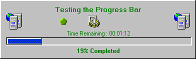



## Modern Progress Bar \- With AVI like animation and Time remaining\.

### Description

Progress Bar. No API calls , NO OCX , just plain , good looking and nice. Runs on a seperate form so it can be called modally.
 
### More Info
 

             |
---                |---
**Submitted On**   |2000-05-25 12:03:18
**By**             |[N/A](https://github.com/Planet-Source-Code/PSCIndex/blob/master/ByAuthor/empty.md)
**Level**          |Intermediate
**User Rating**    |4.6 (23 globes from 5 users)
**Compatibility**  |VB 5\.0, VB 6\.0
**Category**       |[Complete Applications](https://github.com/Planet-Source-Code/PSCIndex/blob/master/ByCategory/complete-applications__1-27.md)
**World**          |[Visual Basic](https://github.com/Planet-Source-Code/PSCIndex/blob/master/ByWorld/visual-basic.md)
**Archive File**   |[CODE\_UPLOAD60825252000\.zip](https://github.com/Planet-Source-Code/modern-progress-bar-with-avi-like-animation-and-time-remaining__1-8344/archive/master.zip)

